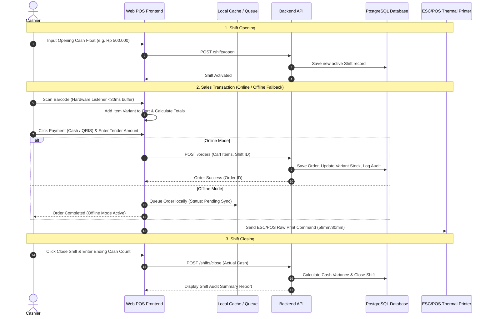

# Product Requirements Document (PRD)
## Multipurpose Retail POS (Point of Sale) Web Application

- **Document Version**: 1.1.0 (Enhanced & Verified)
- **Status**: Implementation-Ready
- **Product Type**: Web Application (`web app`)
- **Target OS / Environment**: Modern Web Browsers (Chrome, Edge, Safari) - Touch Tablet & Desktop Optimized

---

## 1. Overview & Vision

**Multipurpose Retail POS** is a modern, high-performance web-based Point of Sale (POS) system designed specifically for retail store environments. The system streamlines high-frequency checkout operations through instant barcode scanning, flexible product variant management (size, color, SKU), real-time stock tracking, and automated cashier shift reconciliation.

### Value Proposition
- **Lightning-Fast Checkout**: Built for fast-paced retail with full keyboard shortcut and hardware USB/Bluetooth barcode scanner support.
- **Robust Product Variant & Inventory Control**: Tracks stock accurately down to specific SKUs and product variants with audit trails.
- **Cashier Accountability**: Enforces structured cashier shifts (opening float and closing reconciliation) to prevent cash discrepancies.
- **Offline-Resilient Web POS**: Continues sales operations even during internet disconnections via local queue synchronization.

---

## 2. Product Classification & Auditable Checks

- **Classified Product Type**: `web app` (Web Application)
- **Applied Checks**:
  - Web responsive layout & tablet touch usability
  - Global hardware barcode scanner listener & keyboard shortcuts
  - Real-time cart state management & Offline Local Storage (IndexedDB)
  - User Authentication & Role-Based Access Control (RBAC)
  - Database persistence for Products, Variants, SKUs, Shifts, Orders, and Transactions
  - Thermal receipt printing (ESC/POS Web Serial & Browser Print)
- **Skipped Checks (Explicitly Audited)**:
  - Mobile Native SDK / C++ bindings (Not a C++ / Flutter native library)
  - Semver NPM public package deprecation policies (Application codebase, not a public published package)

---

## 3. User Personas & Target Audience

| Persona | Role | Key Responsibilities & Needs |
| :--- | :--- | :--- |
| **Budi (Owner / Admin)** | Owner / Store Manager | Manages product catalogs, variants, pricing, inventory replenishment, views sales analytics & financial reports, manages staff accounts. |
| **Siti (Cashier)** | Front-line Cashier | Opens shift with starting float, scans product barcodes, selects item variants, accepts payments (Cash, QRIS, Card), prints receipts, closes shift with cash audit. |
| **Rian (Supervisor)** | Store Supervisor | Authorizes special manager overrides (discounts > 20%, transaction voids, refunds, manual stock write-offs). |

---

## 4. Goals and Objectives

1. **Checkout Efficiency**: Reduce average transaction time to under 15 seconds per customer.
2. **Barcode Scan Latency**: Ensure barcode input detection and item lookup response time is under 100ms.
3. **Inventory Accuracy**: Eliminate stock mismatch by updating inventory automatically upon transaction completion.
4. **Shift Reconciliation**: Eliminate un-tracked cash differences through mandatory shift opening and closing cash counts.
5. **Zero Downtime Checkout**: 100% offline checkout availability when network connection drops.

---

## 5. Functional Requirements (Organized by Priority)

### P0 (Must-Have for Initial Release - MVP)
- **F-01: Product & Variant Management**:
  - Support parent products with multiple variants (e.g., T-Shirt -> Red / XL, Blue / M).
  - Unique SKU and Barcode assignment per variant.
  - Price, cost price (COGS), and stock quantity per variant SKU.
  - **F-01.1 (Inventory Audit Log)**: Record stock in/out adjustments, damages, and manual write-offs with audit logs.
- **F-02: Cashier Terminal & Barcode Scanner Integration**:
  - **F-02.1 (Global Scanner Listener)**: Global keyboard listener (buffer interval <30ms) capturing scanner input regardless of active DOM element focus.
  - Quick manual product search (by Name, SKU, or Barcode).
  - Cart management (item quantity increment/decrement, variant selector dialog, item deletion).
  - Auto-calculation of Subtotal, Tax (Inclusive/Exclusive PPN 11%), Discounts, and Total.
  - **F-02.2 (Offline Queue & Sync)**: Store pending offline orders in LocalStorage/IndexedDB during network loss and auto-sync when online.
- **F-03: Payments & Receipt Printing**:
  - Multi-payment support: Cash (with auto change calculation), QRIS (Static/Dynamic), Debit/Credit Card, Bank Transfer.
  - **F-03.1 (ESC/POS Thermal Printing)**: Direct raw ESC/POS command thermal printing (Web Serial/Bluetooth 58mm/80mm) & Browser Print fallback.
- **F-04: Shift Management & Cash Float**:
  - Mandatory Shift Open: Input initial cash float before starting sales.
  - Shift Summary: Total cash sales, non-cash sales, total transactions.
  - Mandatory Shift Close: Input actual drawer cash, auto-calculate variance (Expected vs Actual).
- **F-05: Basic Authentication & RBAC**:
  - Secure Login/Logout for Admin, Cashier, and Supervisor.

### P1 (Should-Have for Phase 2)
- **F-06: Low Stock & Reorder Alerts**:
  - Dashboard notifications when variant stock drops below safety threshold.
- **F-07: Sales Analytics Dashboard**:
  - Daily, weekly, monthly sales charts.
  - Top-selling products / variants report (Fast-moving items).
  - Cashier performance and shift history report.
- **F-08: Transaction Void & Manager Override**:
  - Supervisor PIN requirement to void a completed order or apply custom discount.

### P2 (Could-Have for Future Releases)
- **F-09: Customer Loyalty & Membership**:
  - Point earning and customer discount tiers.
- **F-10: Multi-Outlet / Multi-Branch Support**:
  - Centralized inventory management across multiple physical stores.

---

## 6. Non-Functional Requirements

- **Performance**:
  - Initial POS Web App page load under 2.0 seconds.
  - Barcode scan to cart addition response time < 100ms.
- **Usability & UX**:
  - High-contrast, tablet-friendly UI with large touch targets.
  - Full keyboard navigation support (`F1` Search, `F2` Pay, `Esc` Clear, `F4` Variant).
- **Reliability & Offline Resiliency**:
  - Local IndexedDB storage queue for 500+ offline transactions.
  - Automatic background reconnection and transaction sync.
- **Security**:
  - Hashed password storage (bcrypt/Argon2).
  - JWT token authentication with role authorization middleware.

---

## 7. Key User Journeys

---

## 8. Success Metrics

1. **Zero Cash Variance**: Cashier drawer actual cash matches calculated expected cash at shift end (variance < 0.5%).
2. **Scan Success Rate**: 99.9% barcode scan accuracy without manual code entry.
3. **System Uptime**: 100% checkout availability (online + offline local queue).
4. **Checkout Speed**: Average checkout time <= 15 seconds per 5-item cart.

---

## 9. Timeline & Milestones

- **Phase 1 (Week 1)**: PRD Verification, Feature Breakdown (`FEATURES.md`), and Architecture Rules (`RULES.md`).
- **Phase 2 (Week 2)**: Database Schema, Backend API (Products, Variants, Orders, Shifts), & Auth Middleware.
- **Phase 3 (Week 3)**: Web POS Frontend UI (Cart Panel, Global Barcode Listener, ESC/POS Print, Shift Modal).
- **Phase 4 (Week 4)**: Offline Sync Queue, E2E Testing, and Production Release.

---

## 10. Open Questions & Verification Traceability

1. **Traceability**: All 5 gaps identified in `PRD-REVIEW.md` (GAP-01 to GAP-05) have been incorporated into features F-01.1, F-02.1, F-02.2, and F-03.1.
2. **Next Workflow Step**: Execute `/extract-features` (Step 3) to generate `FEATURES.md` with MoSCoW prioritization.
